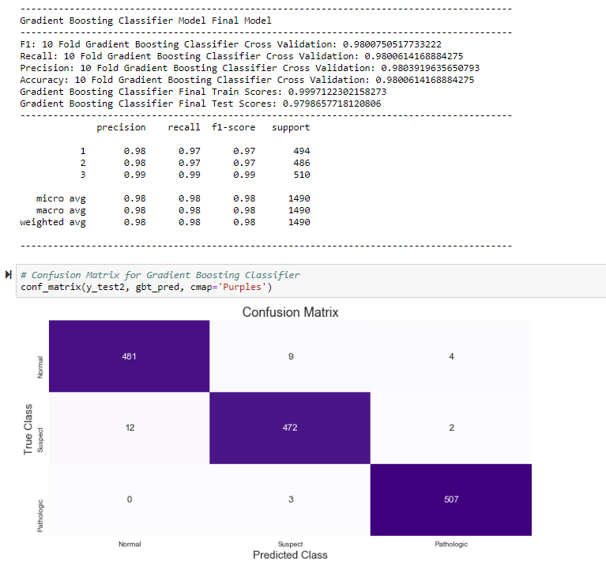

# MOD-3-Final-Project Diagnostic Cardiotocography with Machine Learning

# Introduction: ML Based Diagnostic Tool for Evaluating CTG
* Cardiotocograhy (CTG) is a technical means of recording the fetal heartbeat and the uterine contractions during pregnancy.
* CTG is commonly used to monitor fetal wellbeing 
* Results are interpreted by a physician using the following guidelines set by International Federation of Gynaecology and Obstetrics (FIGO)

# Updated 2015 FIGO Intrapartum Fetal Monitoring Guidelines
- **Normal**: No hypoxia/acidosis, no intervention necessary to improve fetal oxygenation state:
    * Baseline 110-160 bpm
    * Variability 5-25 bpm
    * No repetitive decelerations (decelerations are defined as repetitive when associated with > 50% contractions)
    
- **Suspicious**: Low probability of hypoxia/acidosis, warrants action to correct reversible causes if identified, close monitoring or adjunctive methods:
    * Lacking at least one characteristic of normality, but with no pathological features.
    
- **Pathological**: High probability of hypoxia/acidosis, requires immediate action to correct reversible causes, adjunctive methods, or if this is not possible expedite delivery. In acute situations immediate delivery should be accomplished
    * Deceleration > 5 min
    * Baseline <100 bpm
    * Reduced or increased variability or sinusoidal pattern
    * Repetitive late or prolonged decelerations for > 30 min, or > 20 min if reduced variability (decelerations are defined as repetitive when associated with > 50% contractions) [Wikipedia](https://en.wikipedia.org/wiki/Cardiotocography)
    
# Features of the CTG Dataset

# The Dataset
- The CTG Dataset has 2126 different CTG test results. Each evaluated and scored by a physician
- [Cardiotocography Data Set](https://archive.ics.uci.edu/ml/datasets/cardiotocography)
- The evaluations are based on the 21 feature observations (listed above) of each CTG test.
- The physicians then classified each test into one of three categories according to FIGO guidelines
    * Normal
    * Suspicious
    * Pathological

# Objective and Methodology
* We will develop a machine learning model, as a diagnostic tool, for effectively classifying CTG test results
* We will use a supervised Machine Learning approach. Models will be trained to predict three outcome categories(Normal (1), Suspicious (2), Pathological (3)) using 70%  of the dataset of the target labeled dataset.
* The model will then be evaluated by its ability to predict classes for the remaining 30% of unseen data.
* The most promising models will be further scrutinized using 10-fold cross validation for each of the four most important metrics: F1 score, Precision, Recall and Accuracy.
* The best performing model will have high and consistent results for all 4 of these 10 fold cross validated metrics
* This will give us high confidence that the model performs well across the entire dataset and that our results are not anamalous.

# Final Model

# Conclusion: Gradient Boosted CLF is Best Model for Predicting CTG results
* The Gradient Boosted CLF and SVM Models both had impressive results
* SVM had 10-fold cross validated scores of 97.4% for Precision, Recall, Accuracy and F1 score. However, from the graph above we can see the values in this 10-fold cross validation ranged over almost 4 %
* Gradient Boosted CLF had 10-fold cross validated scores of 98% for Precision, Recall, Accuracy and F1 score. And it can be seen that all values were tightly grouped and ranged only close to 1%.  A much smaller standard deviation
* This means we can expect much better consistency from this model.
* The Gradient Boosted CLF model best minimized the most important types of error we were trying to avoid.
* This model had the fewest misclassified Suspicious and Pathological cases at only 1.2%.  This is most important from a medical perspective.  Having cases that need medical attention be classified as Normal and go untreated.
* This model also had the fewest Normal case classified as Suspicious or Abnormal 2.2%. This is important from an unnecessary cost perspective.
* These are both very low numbers and certainly within the tolerance of a useful diagnostic tool.

# Cost-Benefit Analysis from a Medical Diagnostic Tool Perspective
* Almost no medical testing procedure is 100% accurate in all cases.  One must weigh the consequences of false outcomes in a medical test.
* Medical tests seek to avoid false negative outcomes. This means a patient, or in this case an unborn fetus, in need of medical attention will go untreated.
* A good medical test also seeks to avoid as many false positive outcomes as possible.  This means a healthy subject is classified as unhealthy. This leads to means the patient could undergo unnecessary medical treatment which is costly and stressful to the patient.
* The is particularly true if this means invasive procedures such as surgery or chemotherapy.
* In our case the downstream treatments are not as harsh or costly but still need to be minimized. Further monitoring and CTG are non-invasive and less expensive by medical standards. Healthy individuals that were misdiagnosed by this test would likely be found to be normal through further monitoring.
* If the case of Suspicious and Abnormal cases. Our concern was less if these classes were switched.  Both would be subject to further monitoring and the true nature of the case will more than likely be determined by other methods.
* Our model did well in all areas but specifically the two areas of most concern
* First Concern False negatives. Classifying a fetus that is suspect or pathological as healthy. This means a potential problem pregnancy could go untreated.
* 0/508 Pathological called Normal:
* 12/486 Suspect called Normal:
* Critical false negatives cases: 12/994 = 1.2%
* Critical false positive cases: Normal called either Pathological or Suspicious = 12/494 = 2.4%
* This test performed well in both cases. Well within the tolerance of a useful diagnostic tool

# Future Directions:
* I believe this is solid model with real Potential as a medical diagnostic tool. The metrics from this test are as good or better than any I have seen in published literature
* As always, the real test is more data.  This model needs to be tested against new data that it has never seen before for true evaluation.  It is the life cycle and workflow of any modeling project.  Put forth your best model trained and validated on all available data then test against new data.
* Then re-optimize the model and re-deploy.
* I chose the three model types most cited in the literature. Then I investigated these along with Ensemble methods. The other main model use in the literature was the Naive Bayes model. However, this was usually tried but did not perform as well as other models.
* I think I have found a very useful and reliable model
* I do not have experience using them yet, but my gut feeling is the only thing that can rival this model will be deep neural networks.  I would like to try that when I am introduced to them
* I have also considered making this a two-class classification problem.  Abnormal vs Normal.  However, after further investigation I have found out that the classification rules and procedures are governed by medical boards like FIGO listed in the introduction. 
* In 2015 they redefined the diagnostic classifications of CTG to specifically be Normal, Suspect and Pathological.
* If this is to be a tool useful for real world medical diagnostics it is probably better to stay within those confines
